# Could you have survived the Titanic ?!!

We all know about the luxurious streamline - RMS Titanic which killed around 1500 passengers during its maiden trip to New York! After a lot of research, its believed that once lauded as state-of-art design, had many flaws. In other words, unfortunately, it was bound to be doomed! With the dataset from Kaggle, I want to explore the chances of surviving this disaster! 
Some of my research questions are: 
    How many passengers survived?
    Did the class of passenger matter? If yes, What proportion of lower class passengers survived the disaster? 
    What was the proportion of females and males travelling? 
    Did women and children have more chances of survival than the others? 


```python
%pylab inline
import pandas as pd
import numpy as np
import matplotlib.pyplot as plt
import seaborn as sns

titanic = pd.read_csv('C:/Users/Kousalya/Downloads/titanic-data.csv')
titanic.head()

```

    Populating the interactive namespace from numpy and matplotlib
    


<div>
<style>
    .dataframe thead tr:only-child th {
        text-align: right;
    }

    .dataframe thead th {
        text-align: left;
    }

    .dataframe tbody tr th {
        vertical-align: top;
    }
</style>
<table border="1" class="dataframe">
  <thead>
    <tr style="text-align: right;">
      <th></th>
      <th>PassengerId</th>
      <th>Survived</th>
      <th>Pclass</th>
      <th>Name</th>
      <th>Sex</th>
      <th>Age</th>
      <th>SibSp</th>
      <th>Parch</th>
      <th>Ticket</th>
      <th>Fare</th>
      <th>Cabin</th>
      <th>Embarked</th>
    </tr>
  </thead>
  <tbody>
    <tr>
      <th>0</th>
      <td>1</td>
      <td>0</td>
      <td>3</td>
      <td>Braund, Mr. Owen Harris</td>
      <td>male</td>
      <td>22.0</td>
      <td>1</td>
      <td>0</td>
      <td>A/5 21171</td>
      <td>7.2500</td>
      <td>NaN</td>
      <td>S</td>
    </tr>
    <tr>
      <th>1</th>
      <td>2</td>
      <td>1</td>
      <td>1</td>
      <td>Cumings, Mrs. John Bradley (Florence Briggs Th...</td>
      <td>female</td>
      <td>38.0</td>
      <td>1</td>
      <td>0</td>
      <td>PC 17599</td>
      <td>71.2833</td>
      <td>C85</td>
      <td>C</td>
    </tr>
    <tr>
      <th>2</th>
      <td>3</td>
      <td>1</td>
      <td>3</td>
      <td>Heikkinen, Miss. Laina</td>
      <td>female</td>
      <td>26.0</td>
      <td>0</td>
      <td>0</td>
      <td>STON/O2. 3101282</td>
      <td>7.9250</td>
      <td>NaN</td>
      <td>S</td>
    </tr>
    <tr>
      <th>3</th>
      <td>4</td>
      <td>1</td>
      <td>1</td>
      <td>Futrelle, Mrs. Jacques Heath (Lily May Peel)</td>
      <td>female</td>
      <td>35.0</td>
      <td>1</td>
      <td>0</td>
      <td>113803</td>
      <td>53.1000</td>
      <td>C123</td>
      <td>S</td>
    </tr>
    <tr>
      <th>4</th>
      <td>5</td>
      <td>0</td>
      <td>3</td>
      <td>Allen, Mr. William Henry</td>
      <td>male</td>
      <td>35.0</td>
      <td>0</td>
      <td>0</td>
      <td>373450</td>
      <td>8.0500</td>
      <td>NaN</td>
      <td>S</td>
    </tr>
  </tbody>
</table>
</div>


```python
titanic.info()
```

    <class 'pandas.core.frame.DataFrame'>
    RangeIndex: 891 entries, 0 to 890
    Data columns (total 12 columns):
    PassengerId    891 non-null int64
    Survived       891 non-null int64
    Pclass         891 non-null int64
    Name           891 non-null object
    Sex            891 non-null object
    Age            714 non-null float64
    SibSp          891 non-null int64
    Parch          891 non-null int64
    Ticket         891 non-null object
    Fare           891 non-null float64
    Cabin          204 non-null object
    Embarked       889 non-null object
    dtypes: float64(2), int64(5), object(5)
    memory usage: 83.6+ KB
    


```python
titanic.describe()
```


<div>
<style>
    .dataframe thead tr:only-child th {
        text-align: right;
    }

    .dataframe thead th {
        text-align: left;
    }

    .dataframe tbody tr th {
        vertical-align: top;
    }
</style>
<table border="1" class="dataframe">
  <thead>
    <tr style="text-align: right;">
      <th></th>
      <th>PassengerId</th>
      <th>Survived</th>
      <th>Pclass</th>
      <th>Age</th>
      <th>SibSp</th>
      <th>Parch</th>
      <th>Fare</th>
    </tr>
  </thead>
  <tbody>
    <tr>
      <th>count</th>
      <td>891.000000</td>
      <td>891.000000</td>
      <td>891.000000</td>
      <td>714.000000</td>
      <td>891.000000</td>
      <td>891.000000</td>
      <td>891.000000</td>
    </tr>
    <tr>
      <th>mean</th>
      <td>446.000000</td>
      <td>0.383838</td>
      <td>2.308642</td>
      <td>29.699118</td>
      <td>0.523008</td>
      <td>0.381594</td>
      <td>32.204208</td>
    </tr>
    <tr>
      <th>std</th>
      <td>257.353842</td>
      <td>0.486592</td>
      <td>0.836071</td>
      <td>14.526497</td>
      <td>1.102743</td>
      <td>0.806057</td>
      <td>49.693429</td>
    </tr>
    <tr>
      <th>min</th>
      <td>1.000000</td>
      <td>0.000000</td>
      <td>1.000000</td>
      <td>0.420000</td>
      <td>0.000000</td>
      <td>0.000000</td>
      <td>0.000000</td>
    </tr>
    <tr>
      <th>25%</th>
      <td>223.500000</td>
      <td>0.000000</td>
      <td>2.000000</td>
      <td>20.125000</td>
      <td>0.000000</td>
      <td>0.000000</td>
      <td>7.910400</td>
    </tr>
    <tr>
      <th>50%</th>
      <td>446.000000</td>
      <td>0.000000</td>
      <td>3.000000</td>
      <td>28.000000</td>
      <td>0.000000</td>
      <td>0.000000</td>
      <td>14.454200</td>
    </tr>
    <tr>
      <th>75%</th>
      <td>668.500000</td>
      <td>1.000000</td>
      <td>3.000000</td>
      <td>38.000000</td>
      <td>1.000000</td>
      <td>0.000000</td>
      <td>31.000000</td>
    </tr>
    <tr>
      <th>max</th>
      <td>891.000000</td>
      <td>1.000000</td>
      <td>3.000000</td>
      <td>80.000000</td>
      <td>8.000000</td>
      <td>6.000000</td>
      <td>512.329200</td>
    </tr>
  </tbody>
</table>
</div>


```python
#Checking for missing values

titanic.apply(lambda x: sum(x.isnull()),axis=0) 
```


    PassengerId      0
    Survived         0
    Pclass           0
    Name             0
    Sex              0
    Age            177
    SibSp            0
    Parch            0
    Ticket           0
    Fare             0
    Cabin          687
    Embarked         2
    dtype: int64


Age, Cabin and Embarked have the missing values. Majorly, 20% of Age values are missing and 77% of Cabin values are missing.
We can replace the missing values in Age variable using the median value, incase Age turns out to be an important variable for prediction later!

## Distribution of Passengers by Cabin


```python
#For the non-numerical values we can look at frequency distribution to understand whether they make sense or not. 

titanic['Cabin'].value_counts() #147 cabins present on the ship
```


    B96 B98        4
    C23 C25 C27    4
    G6             4
    F33            3
    C22 C26        3
    E101           3
    F2             3
    D              3
    B58 B60        2
    B51 B53 B55    2
    E25            2
    B18            2
    E44            2
    D35            2
    E67            2
    E121           2
    D36            2
    E33            2
    F4             2
    B28            2
    B5             2
    C83            2
    C93            2
    F G73          2
    C123           2
    D33            2
    B20            2
    C125           2
    C78            2
    D17            2
                  ..
    C106           1
    C7             1
    A34            1
    C47            1
    E63            1
    B50            1
    C99            1
    E38            1
    B73            1
    B42            1
    A26            1
    D11            1
    F G63          1
    F38            1
    E49            1
    E12            1
    D46            1
    E40            1
    D49            1
    B38            1
    D15            1
    A31            1
    C118           1
    A24            1
    B37            1
    C128           1
    C104           1
    D48            1
    D47            1
    C85            1
    Name: Cabin, Length: 147, dtype: int64


From the above values, it seems like there are 6 cabins namely [A,B,C,D,E,F,G] and the numbers with them are the seat numbers.
To see the distribution of people in each of the cabins.


```python
cabinNames = titanic['Cabin'].dropna()
```


```python
coaches = []

for i in cabinNames:
    coaches.append(i[0])

cabins_df = pd.DataFrame(coaches)    
cabins_df.columns = ['CabinName']

```


```python
sns.factorplot('CabinName', order = ['A','B','C','D','E','F','G'], data = cabins_df, kind='count')
```


    <seaborn.axisgrid.FacetGrid at 0xc5962b0>


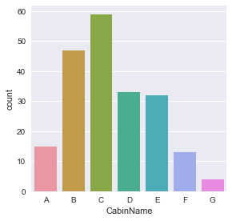


Looking at the distribution, looks like cabin C had majority of the passengers and then cabin B. 

## What was the proportion of females and males travelling? 


```python
titanic['Sex'].value_counts()
```


    male      577
    female    314
    Name: Sex, dtype: int64


Out of 891, 65% of them are males and rest 35% are females.

## How many children were on-board? 


```python
def isChild(onboarder):
    Age, sex = onboarder
    if Age < 21:
        return 'child'
    else:
        return sex

titanic['status'] = titanic[['Age','Sex']].apply(isChild, axis = 1)
```


```python
titanic['status'].value_counts()
```


    male      474
    female    237
    child     180
    Name: status, dtype: int64


It looks like there were 180 children on the ship! That means, 53% are males, 26.5% are females and 20% are children.


```python
sns.countplot(x = 'status', hue='Pclass',data = titanic)
```


    <matplotlib.axes._subplots.AxesSubplot at 0xe3d2c88>


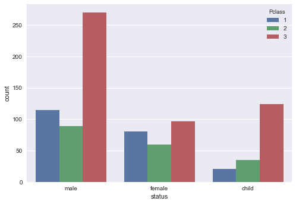


Seeing the distribution of people across the different classes, we see that majority of the passengers were in the lower class. 


```python
sns.countplot(x = 'status', hue='Survived',data = titanic)
```


    <matplotlib.axes._subplots.AxesSubplot at 0xe499d30>


```python
sns.barplot(data=titanic, x='status', y='Survived')
```


    <matplotlib.axes._subplots.AxesSubplot at 0xe4bad68>


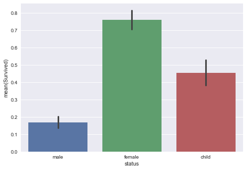


```python
titanic_males = titanic[titanic.status == 'male']
titanic_females = titanic[titanic.status == 'female']
titanic_children = titanic[titanic.status == 'child'] 

```


```python
titanic_males.Survived.mean()
```


    0.16877637130801687


```python
titanic_females.Survived.mean()
```


    0.759493670886076


```python
titanic_children.Survived.mean()
```


    0.45555555555555555


Amongst the 400 males, less than 100 survived. The percent of females and children who survived are more than the number of males.
The survivability rate for males is 0.17, for women it's the highest being 0.76 and children - 0.46
Therefore, looking at this chart, we can safely say that the most women and 50% of the children survived compared to men!

## Did the class of passenger matter?


```python
sns.barplot(data=titanic, x='Pclass', y='Survived')
```


    <matplotlib.axes._subplots.AxesSubplot at 0xe588898>


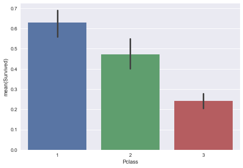


```python
sns.countplot(x = 'Pclass', hue='status',data = titanic)
```


    <matplotlib.axes._subplots.AxesSubplot at 0xe67d160>


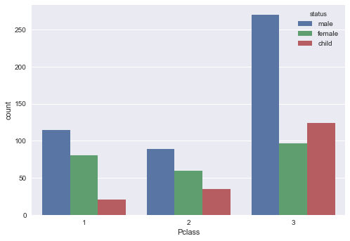


```python
sns.countplot(x = 'Pclass', hue='Survived',data = titanic)
```


    <matplotlib.axes._subplots.AxesSubplot at 0xe5eaf98>


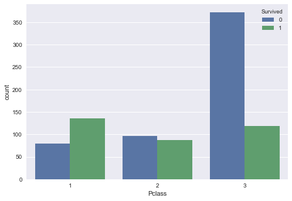


```python
upperClass_psgrs = titanic[titanic.Pclass == 1]
middleClass_psgrs = titanic[titanic.Pclass == 2]
lowerClass_psgrs = titanic[titanic.Pclass == 3]
```


```python
upperClass_psgrs.Survived.mean()
```


    0.6296296296296297


```python
middleClass_psgrs.Survived.mean()
```


    0.47282608695652173


```python
lowerClass_psgrs.Survived.mean()
```


    0.24236252545824846


We can say that there is some relation between the survival rate and the class in which the passenger was travelling! Looks like the first class passengers have higher chances compared to the other classes.
First class passengers have a survival rate of 63%, middle class has 48% and lower class has around 24%
Hence, the survival rate of first class passengers is almost three times higher than the survival rate of a passenger travelling in third class cabin!

## Did age effect survivability?


```python
titanic['Age'].hist(bins = 20,ec='black')

#From the graph we can't really say much about the survival rate by the age variable
```


    <matplotlib.axes._subplots.AxesSubplot at 0xe7ebb00>


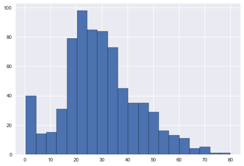


```python
bplt = sns.boxplot(data = titanic, x ='Survived', y='Age')
bplt.set(title ='Age distribution by Survivors' ,xticklabels = ['Dead', 'Survived'])
```


    [[<matplotlib.text.Text at 0xe950c88>, <matplotlib.text.Text at 0xe9572b0>],
     <matplotlib.text.Text at 0xe95f978>]


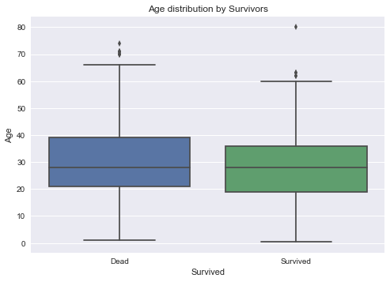


Looking at the boxplots,we can say that the mean of the dead and survived passengers is almost the same. Median of the deceased passengers is much higher compared to the ones who survived, which doesn't really tell us about the relation between Age and survival.


### Age w.r.t Gender


```python
bplt = sns.boxplot(data = titanic, x ='Sex', y='Age', hue='Survived')
bplt.set(title ='Age distribution by Gender')
```


    [<matplotlib.text.Text at 0xea33c18>]


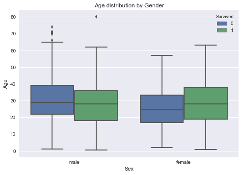


This boxplot throws some interesting light on the age of the survived females, it looks like the older women were given more preference. Incase of men, the mean age of the ones who survived or drowned is almost similar. 

### Age w.r.t Pclass


```python
bplt = sns.boxplot(data = titanic, x ='Pclass', y='Age', hue='Survived')
bplt.set(title ='Age distribution by class')
```


    [<matplotlib.text.Text at 0xeb5a550>]


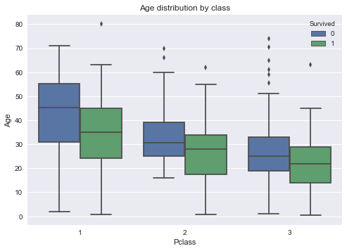


If we categorize the data by class, it seems like the survivability favors younger people, which can be because they were more quicker (and agile!) in saving themselves!

## Distribution by Embarked City


```python
sns.countplot(x = 'Embarked', hue='Survived',data = titanic)
```


    <matplotlib.axes._subplots.AxesSubplot at 0xec69198>


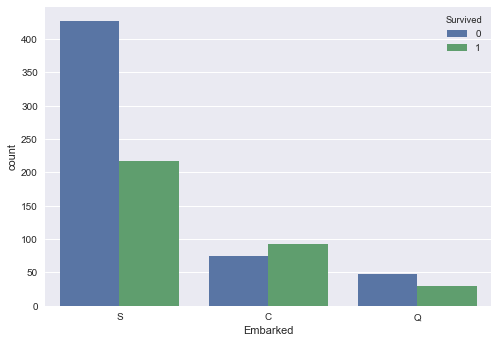


```python
cher_psgrs = titanic[titanic.Embarked == 'C']
queen_psgrs = titanic[titanic.Embarked == 'Q']
south_psgrs = titanic[titanic.Embarked == 'S']
```


```python
cher_psgrs.Survived.mean()
```


    0.5535714285714286


```python
queen_psgrs.Survived.mean()
```


    0.38961038961038963


```python
south_psgrs.Survived.mean()
```


    0.33695652173913043


The ones who embarked the ship at Cherbourg have survival rate of 55% where as the ones who boarded at Queenstown have 39% & at Southampton have 34%

## Alone vs. Family


```python
titanic['SOLOFAM'] = titanic['SibSp'] + titanic['Parch']
```


```python
titanic['SOLOFAM'].loc[titanic['SOLOFAM'] > 0] = 'Family'
titanic['SOLOFAM'].loc[titanic['SOLOFAM'] == 0] = 'Alone'
```

    F:\Anaconda\lib\site-packages\pandas\core\indexing.py:179: SettingWithCopyWarning: 
    A value is trying to be set on a copy of a slice from a DataFrame
    
    See the caveats in the documentation: http://pandas.pydata.org/pandas-docs/stable/indexing.html#indexing-view-versus-copy
      self._setitem_with_indexer(indexer, value)
    


```python
sns.factorplot('SOLOFAM' , data=titanic, kind='count')
```


    <seaborn.axisgrid.FacetGrid at 0xecb1518>


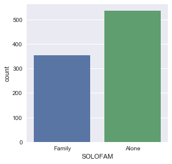


Looks like the majority of the passengers were travelling solo. Lets look at their survival rate


```python
sns.countplot(x = 'SOLOFAM', hue='Survived',data = titanic)
```


    <matplotlib.axes._subplots.AxesSubplot at 0xec887b8>


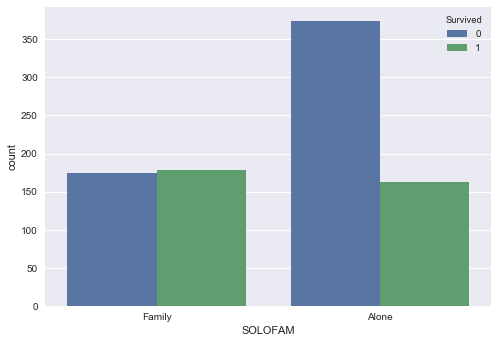


```python
solo_psngrs = titanic[titanic.SOLOFAM == 'Alone']
fam_psngrs = titanic[titanic.SOLOFAM == 'Family']
```


```python
solo_psngrs.Survived.mean()
```


    0.30353817504655495


```python
fam_psngrs.Survived.mean()
```


    0.5056497175141242


The ones who were travelling with their families seemed to have higher survival rate (50 %) compared to the ones travelling alone(30%)

## Finalizing the important factors


```python
titanic.corr()
```


<div>
<style>
    .dataframe thead tr:only-child th {
        text-align: right;
    }

    .dataframe thead th {
        text-align: left;
    }

    .dataframe tbody tr th {
        vertical-align: top;
    }
</style>
<table border="1" class="dataframe">
  <thead>
    <tr style="text-align: right;">
      <th></th>
      <th>PassengerId</th>
      <th>Survived</th>
      <th>Pclass</th>
      <th>Age</th>
      <th>SibSp</th>
      <th>Parch</th>
      <th>Fare</th>
    </tr>
  </thead>
  <tbody>
    <tr>
      <th>PassengerId</th>
      <td>1.000000</td>
      <td>-0.005007</td>
      <td>-0.035144</td>
      <td>0.036847</td>
      <td>-0.057527</td>
      <td>-0.001652</td>
      <td>0.012658</td>
    </tr>
    <tr>
      <th>Survived</th>
      <td>-0.005007</td>
      <td>1.000000</td>
      <td>-0.338481</td>
      <td>-0.077221</td>
      <td>-0.035322</td>
      <td>0.081629</td>
      <td>0.257307</td>
    </tr>
    <tr>
      <th>Pclass</th>
      <td>-0.035144</td>
      <td>-0.338481</td>
      <td>1.000000</td>
      <td>-0.369226</td>
      <td>0.083081</td>
      <td>0.018443</td>
      <td>-0.549500</td>
    </tr>
    <tr>
      <th>Age</th>
      <td>0.036847</td>
      <td>-0.077221</td>
      <td>-0.369226</td>
      <td>1.000000</td>
      <td>-0.308247</td>
      <td>-0.189119</td>
      <td>0.096067</td>
    </tr>
    <tr>
      <th>SibSp</th>
      <td>-0.057527</td>
      <td>-0.035322</td>
      <td>0.083081</td>
      <td>-0.308247</td>
      <td>1.000000</td>
      <td>0.414838</td>
      <td>0.159651</td>
    </tr>
    <tr>
      <th>Parch</th>
      <td>-0.001652</td>
      <td>0.081629</td>
      <td>0.018443</td>
      <td>-0.189119</td>
      <td>0.414838</td>
      <td>1.000000</td>
      <td>0.216225</td>
    </tr>
    <tr>
      <th>Fare</th>
      <td>0.012658</td>
      <td>0.257307</td>
      <td>-0.549500</td>
      <td>0.096067</td>
      <td>0.159651</td>
      <td>0.216225</td>
      <td>1.000000</td>
    </tr>
  </tbody>
</table>
</div>


Looking at the correlation matrix, most of the variables like Age, Pclass, siblings aren't highly correlated with our Survived variable. The only variable with some correlation to Survival is Fare and Parch to an extent. 
Since Fare and Pclass should logically be related - as higher the fare better the class but correlation value between them is negative.
Hence,I feel the variables provided here aren't sufficient to build a model to predict the survivability of the passengers!
